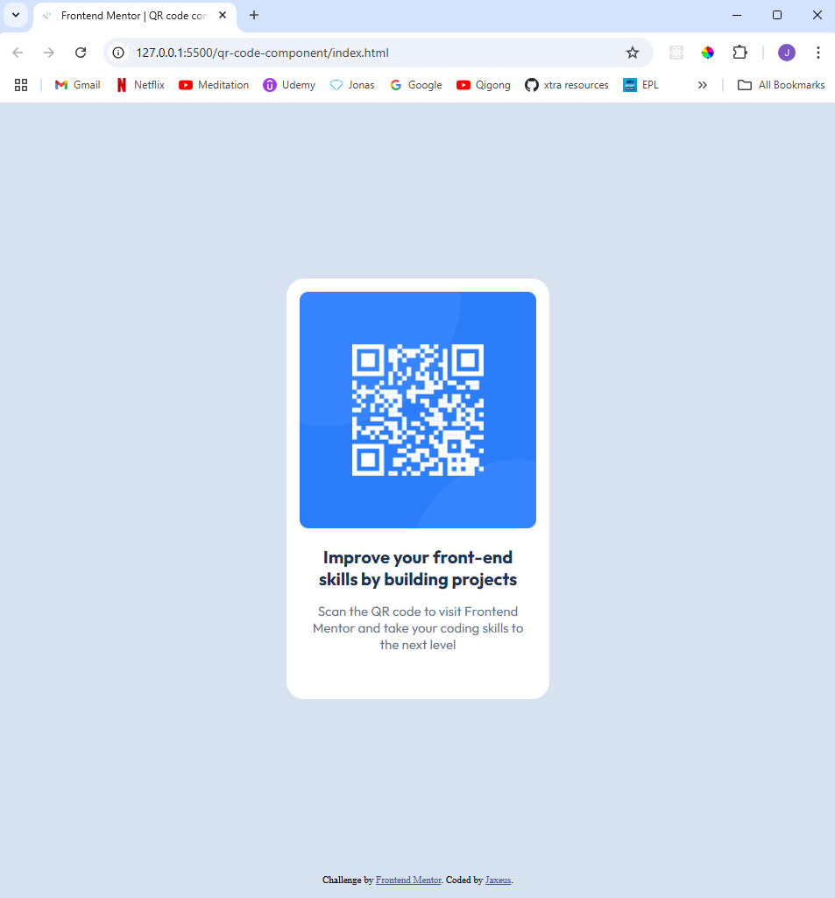

# Frontend Mentor - QR code component solution

This is a solution to the [QR code component challenge on Frontend Mentor](https://www.frontendmentor.io/challenges/qr-code-component-iux_sIO_H). Frontend Mentor challenges help you improve your coding skills by building realistic projects.

## Table of contents

- [Overview](#overview)
  - [Screenshot](#screenshot)
  - [Links](#links)
- [My process](#my-process)
  - [Built with](#built-with)
  - [What I learned](#what-i-learned)
  - [Continued development](#continued-development)
  - [Useful resources](#useful-resources)
- [Author](#author)

## Overview

This is my attempt at the QR Code Component. I tried my best to get it exactly as in the image, but I feel some of the sizing is a little off.

#help
#sizing
#responsiveness

### Screenshot

### Links

- Solution URL: [Add solution URL here](https://your-solution-url.com)
- Live Site URL: [Add live site URL here](https://jaxeus.github.io/qr-code-component/)

## My process

### Built with

- Semantic HTML5 markup
- CSS custom properties
- Flexbox
- Google Fonts
- CSS Variables

### What I learned

I learned that I am lacking in confidence with CSS sizing and responsiveness. I am familiar with different units in CSS but when it comes to building components or web pages/apps, I do not really know what units are best to use. I've heard rem is good to use for responsiveness, but I am not sure when to use other dynamic units like % or vw/vh.

### Continued development

At this stage, I really just need help with sizing and best practices for sizing and responsiveness.

### Useful resources

I didn't really use other resources for this project.

## Author

- Frontend Mentor - [@jaxeus](https://www.frontendmentor.io/profile/jaxeus)
